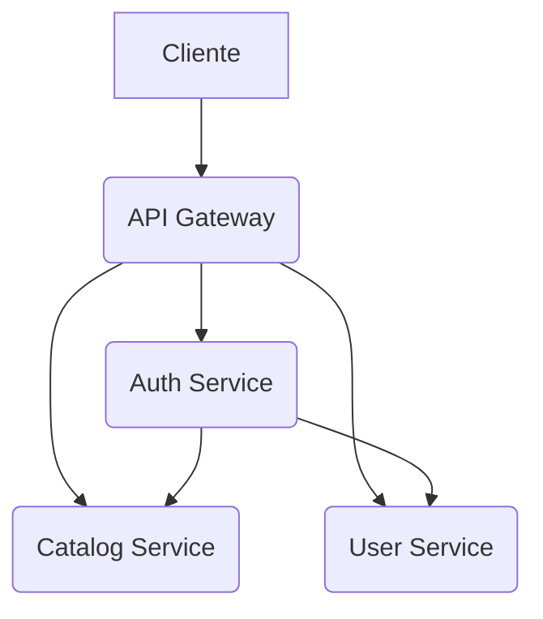

# Proyecto Carnet Digital

Este proyecto implementa una arquitectura de microservicios para la gestión de un carnet digital. Se compone de cuatro servicios principales que interactúan entre sí para proporcionar la funcionalidad completa.

## Arquitectura General

El sistema se organiza en los siguientes microservicios:

*   **API Gateway**: Punto de entrada para todas las solicitudes externas, enrutando las peticiones a los servicios internos correspondientes.
*   **Auth Service**: Encargado de la autenticación y autorización de usuarios.
*   **Catalog Service**: Gestiona datos maestros y catálogos, como áreas, carreras, estados y tipos de identificación/usuario.
*   **User Service**: Administra la información de los usuarios, incluyendo sus fotografías y la generación de códigos QR.

## Servicios y sus Interacciones

### API Gateway

El [API Gateway](file:api-gateway) es el componente frontal que expone las APIs al cliente. Su responsabilidad principal es enrutar las solicitudes a los microservicios adecuados y manejar la autenticación inicial.

*   **Propósito**: Unificar el acceso a los microservicios, proporcionar seguridad (autenticación JWT) y enrutamiento.
*   **Partes Internas**:
    *   [Auth Module](file:api-gateway/src/modules/auth): Maneja las rutas relacionadas con la autenticación.
    *   [Catalog Module](file:api-gateway/src/modules/catalog): Enruta las solicitudes al servicio de catálogo.
    *   [User Module](file:api-gateway/src/modules/user): Enruta las solicitudes al servicio de usuario.
    *   [JwtAuthGuard](file:api-gateway/src/guards/jwt-auth.guard.ts): Protege las rutas que requieren autenticación.
    *   [JwtStrategy](file:api-gateway/src/strategies/jwt.strategy.ts): Valida los tokens JWT.
*   **Relaciones Externas**:
    *   Recibe solicitudes de los clientes.
    *   Se comunica con [Auth Service](node:AuthService) para la autenticación.
    *   Se comunica con [Catalog Service](node:CatalogService) para operaciones de catálogo.
    *   Se comunica con [User Service](node:UserService) para operaciones de usuario.

### Auth Service

El [Auth Service](file:auth-service) es responsable de la lógica de autenticación y autorización.

*   **Propósito**: Gestionar el registro, inicio de sesión, refresco de tokens y validación de credenciales de usuario.
*   **Partes Internas**:
    *   [Auth Controller](file:auth-service/src/auth/auth.controller.ts): Expone los endpoints de autenticación.
    *   [Auth Service](file:auth-service/src/auth/auth.service.ts): Contiene la lógica de negocio para la autenticación.
    *   [Login DTO](file:auth-service/src/auth/dto/login.dto.ts), [Refresh DTO](file:auth-service/src/auth/dto/refresh.dto.ts), [Validate DTO](file:auth-service/src/auth/dto/validate.dto.ts): Objetos de transferencia de datos para las operaciones de autenticación.
*   **Relaciones Externas**:
    *   Recibe solicitudes de autenticación del [API Gateway](node:APIGateway).
    *   Se comunica con [User Service](node:UserService) para validar las credenciales de usuario.
    *   Se comunica con [Catalog Service](node:CatalogService) para obtener información relacionada con el usuario (ej. tipo de usuario).

### Catalog Service

El [Catalog Service](file:catalog-service) se encarga de la gestión de datos maestros y catálogos.

*   **Propósito**: Proporcionar y gestionar datos estáticos o de referencia, como áreas académicas, carreras, estados de elementos y tipos de identificación o usuario.
*   **Partes Internas**:
    *   [Area Module](file:catalog-service/src/area): Gestiona las áreas.
    *   [Carrera Module](file:catalog-service/src/carrera): Gestiona las carreras.
    *   [Estado Module](file:catalog-service/src/estado): Gestiona los estados.
    *   [Tipo Identificacion Module](file:catalog-service/src/tipo-identificacion): Gestiona los tipos de identificación.
    *   [Tipo Usuario Module](file:catalog-service/src/tipo-usuario): Gestiona los tipos de usuario.
    *   [Prisma Service](file:catalog-service/src/shared/services/prisma.service.ts): Interacción con la base de datos a través de Prisma ORM.
*   **Relaciones Externas**:
    *   Recibe solicitudes del [API Gateway](node:APIGateway) para operaciones CRUD en los catálogos.
    *   Puede ser consultado por el [Auth Service](node:AuthService) o [User Service](node:UserService) para obtener datos de referencia.

### User Service

El [User Service](file:user-service) gestiona toda la información relacionada con los usuarios.

*   **Propósito**: Administrar el ciclo de vida de los usuarios, incluyendo su creación, actualización, gestión de fotografías y generación de códigos QR para el carnet digital.
*   **Partes Internas**:
    *   [Usuario Module](file:user-service/src/usuario): Contiene la lógica principal para la gestión de usuarios.
    *   [Fotografia Module](file:user-service/src/fotografia): Maneja la subida y gestión de fotografías de usuario.
    *   [QR Module](file:user-service/src/qr): Genera códigos QR para los carnets digitales.
    *   [Prisma Service](file:user-service/src/common/prisma.service.ts): Interacción con la base de datos a través de Prisma ORM.
*   **Relaciones Externas**:
    *   Recibe solicitudes del [API Gateway](node:APIGateway) para operaciones CRUD de usuarios.
    *   Proporciona información de usuario al [Auth Service](node:AuthService) para la validación de credenciales.
    *   Almacena datos de usuario en su propia base de datos.

### Implementation Steps

1. **Understanding the Overall Architecture**
   The system is built as a microservices architecture for a digital ID card project. It consists of four main services: an `API Gateway` as the entry point, an `Auth Service` for authentication, a `Catalog Service` for master data, and a `User Service` for user information and QR code generation. These services interact to provide the full functionality.

2. **Exploring the API Gateway**
   The `API Gateway` acts as the primary entry point for all external requests. Its purpose is to unify access to the microservices, provide security through JWT authentication, and route requests to the appropriate internal services. It handles authentication, catalog, and user-related routes, using guards and strategies for token validation. It communicates with the `Auth Service` for authentication, and with the `Catalog Service` and `User Service` for their respective operations.

3. **Exploring the Auth Service**
   The `Auth Service` is dedicated to managing user authentication and authorization. Its core purpose is to handle user registration, login, token refreshing, and credential validation. It exposes endpoints for authentication and contains the business logic for these operations. It receives authentication requests from the `API Gateway` and interacts with the `User Service` to validate credentials, and with the `Catalog Service` to retrieve user-related information.

4. **Exploring the Catalog Service**
   The `Catalog Service` is responsible for managing master data and reference catalogs. Its purpose is to provide and manage static or reference data such as academic areas, careers, status types, and identification or user types. It includes modules for managing areas, careers, states, identification types, and user types, and uses a Prisma service for database interaction. It receives requests from the `API Gateway` for CRUD operations on catalogs and can be queried by the `Auth Service` or `User Service` for reference data.

5. **Exploring the User Service**
   The `User Service` manages all user-related information. Its purpose is to administer the user lifecycle, including creation, updates, photograph management, and QR code generation for the digital ID card. It contains modules for user management, photograph handling, and QR code generation, and uses a Prisma service for database interaction. It receives requests from the `API Gateway` for user CRUD operations and provides user information to the `Auth Service` for credential validation, storing user data in its own database.

